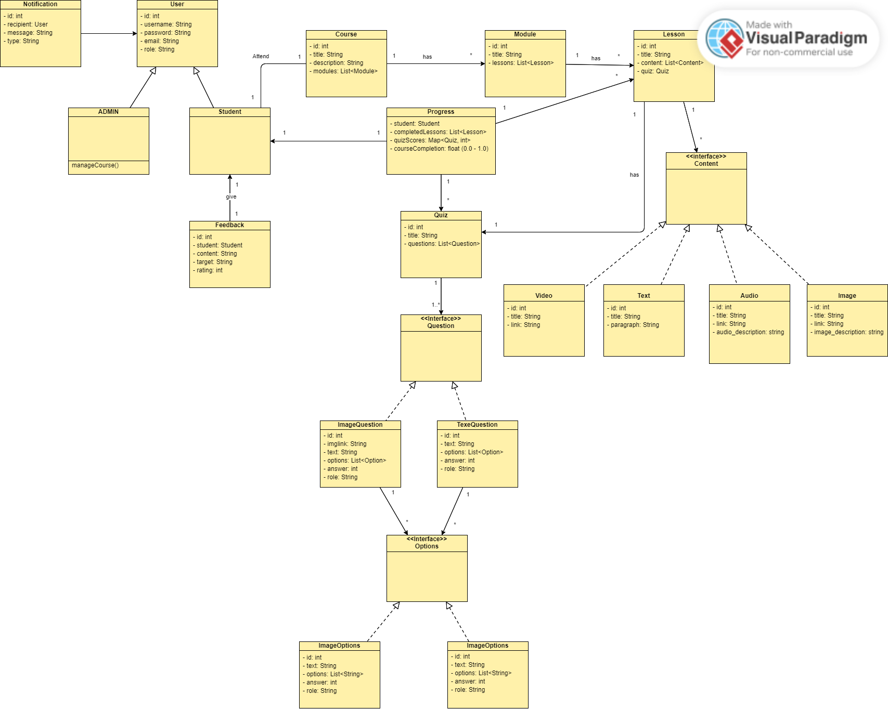
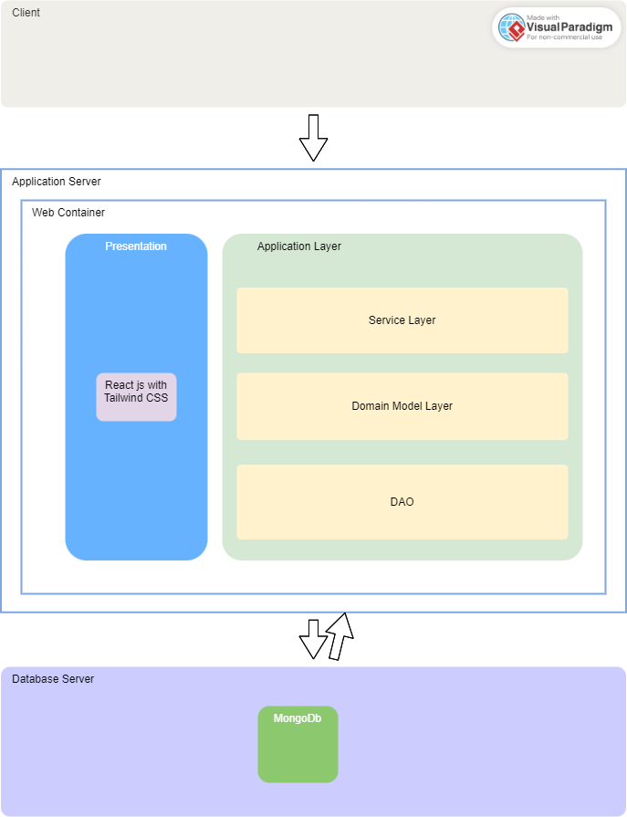

## Light Driving School

Light driving school
Design and develop a comprehensive online driving school platform aimed at facilitating student registration, course enrollment, and access to interactive learning materials. The platform should empower administrative staff to seamlessly add modules, lessons, and quizzes. Each lesson should support diverse content types such as videos, text, or audio, and modules may contain multiple lessons. Additionally, students should be able to take lessons and associated quizzes to gauge their comprehension. The system should allow users to resume previously unfinished lessons, ensuring a continuous learning experience. Furthermore, administrators should have efficient tools for managing course content. Upon course completion, the system should generate a certificate for the student.
Additional Functionality:
1.	User Profile Management: Allow students and staff to create and manage their profiles, including personal information and course progress tracking.
2.	Discussion Forums: Implement discussion forums where students can engage in discussions, ask questions, and share experiences related to the course content.
3.	Progress Tracking: Provide comprehensive tracking of student progress, including completed lessons, quiz scores, and overall course completion percentage.
4.	Notification System: Incorporate a notification system to alert users about new course materials, upcoming quizzes, and important announcements.
5. Feedback Mechanism: Enable students to provide feedback on courses, lessons, and quizzes to improve the overall learning experience.

## Requirement Analysis for Light Driving School Online Platform
### 1. User Requirements
#### Students:

- Register and create profiles.
- Enroll in available courses.
- Access lessons (video, text, audio) and quizzes.
- Resume unfinished lessons.
- Track progress (completed lessons, quiz scores, course completion percentage).
- Provide feedback on courses, lessons, and quizzes. (Not Included)
- Obtain a certificate upon course completion.(Not Included)

#### Administrative Staff:

- Register and create profiles.
- Add and manage modules, lessons, and quizzes.
- Track student progress and performance.
- Manage course content and structure.
- Receive and review student feedback.(Not Included)
- Send notifications to students.(Not Included)
### 2. Functional Requirements
#### User Profile Management:

- Students and staff can create, view, edit, and delete profiles.
- Store personal information and track course progress.
  
#### Course Management:

- Admins can create, update, and delete courses.
- Courses consist of multiple modules.
- Modules consist of multiple lessons.
- Lessons support video, text, and audio content.
- 
#### Lesson and Quiz Management:

- Admins can add, update, and delete lessons and quizzes.
- Lessons support various content types.
- Quizzes linked to lessons for comprehension assessment.
- Track quiz scores.
#### Progress Tracking:

- Track and display completed lessons, quiz scores, and overall course completion percentage for students.

### Class Diagram

### Architecture Diagram

### ER-Diagram

#### User

##### Attributes: username, email, phoneNumber, password, role, firstName, lastName, coursesEnrolled, progress, timestamps
#####  Relationships:
Enrolls in many Courses (Many-to-Many)
Has many Progress records (One-to-Many)
#### Course

#####  Attributes: title, description, modules, addedBy, timestamps
#####  Relationships:
Has many Modules (One-to-Many)
Added by one User (Many-to-One)
Has many Users enrolled (Many-to-Many)
Has many Progress records (One-to-Many)
#### Module

##### Attributes: title, description, lessons, addedBy, moduleNumber, courseId, timestamps
##### Relationships:
Belongs to one Course (Many-to-One)
Has many Lessons (One-to-Many)
Added by one User (Many-to-One)
#### Lesson

##### Attributes: title, description, contents, addedBy, lessonNumber, moduleId, quiz, timestamps
##### Relationships:
Belongs to one Module (Many-to-One)
Has many Contents (One-to-Many)
Has one Quiz (One-to-One)
Added by one User (Many-to-One)
#### Content

##### Attributes: type, title, addedBy, contentNumber, lessonId, timestamps
##### Relationships:
Belongs to one Lesson (Many-to-One)
Added by one User (Many-to-One)
#### Quiz

##### Attributes: title, description, lessonId, questions, addedBy, timestamps
##### Relationships:
Belongs to one Lesson (Many-to-One)
Has many Questions (One-to-Many)
Added by one User (Many-to-One)
#### Question

##### Attributes: quizId, type, options, correctAnswerLetter, questionNumber, addedBy, timestamps
##### Relationships:
Belongs to one Quiz (Many-to-One)
Added by one User (Many-to-One)
#### Progress

##### Attributes: studentId, courseId, courseContent, finalTestProgress, timestamps
##### Relationships:
Belongs to one User (Many-to-One)
Belongs to one Course (Many-to-One)

#### Choice

##### Attributes: choiceLetter, type, content (text, imageUrl, videoUrl, description)
##### Relationships:
Part of Question (Many-to-One, via subdocument)
